# 搭建自己的 SSR

---

- [搭建自己的 SSR](#搭建自己的-ssr)
  - [Vue SSR 介绍](#vue-ssr-介绍)
    - [是什么](#是什么)
    - [使用场景](#使用场景)
    - [如何实现 Vue SSR](#如何实现-vue-ssr)
  - [Vue SSR 基本使用](#vue-ssr-基本使用)
    - [渲染一个 Vue 实例](#渲染一个-vue-实例)
    - [与服务器集成](#与服务器集成)
    - [使用一个页面模板](#使用一个页面模板)
  - [构建同构渲染](#构建同构渲染)
    - [构建流程](#构建流程)
    - [源码结构](#源码结构)
    - [构建配置](#构建配置)
      - [安装依赖](#安装依赖)
      - [配置文件及打包命令](#配置文件及打包命令)
      - [启动应用](#启动应用)
      - [解析渲染流程](#解析渲染流程)
      - [构建开发模式](#构建开发模式)
        - [基本思路](#基本思路)
        - [封装处理模块](#封装处理模块)
        - [更新模板](#更新模板)
        - [更新服务端打包](#更新服务端打包)
        - [将打包结果存储到内存中](#将打包结果存储到内存中)
        - [更新客户端打包](#更新客户端打包)
        - [热更新](#热更新)
          - [工作原理：](#工作原理)
  - [编写通用代码](#编写通用代码)
    - [服务器上的数据响应](#服务器上的数据响应)
    - [组件生命周期钩子函数](#组件生命周期钩子函数)
    - [访问特定平台(Platform-Specific) API](#访问特定平台platform-specific-api)
    - [区分运行环境](#区分运行环境)
    - [自定义指令](#自定义指令)
  - [路由和代码分割](#路由和代码分割)
    - [测试路由](#测试路由)
  - [管理页面 Head](#管理页面-head)
  - [数据预取和状态](#数据预取和状态)
  - [服务端渲染优化](#服务端渲染优化)
    - [页面级别缓存 (Page-level Caching)](#页面级别缓存-page-level-caching)
    - [Gzip 压缩: compression](#gzip-压缩-compression)
    - [组件级别缓存 (Component-level Caching)](#组件级别缓存-component-level-caching)

---

## Vue SSR 介绍

### 是什么

- [https://ssr.vuejs.org/zh/](https://ssr.vuejs.org/zh/)
- Vue SSR（Vue.js Server-Side Rendering） 是 Vue.js 官方提供的一个服务端渲染（同构应用）解决方案
- 使用它可以构建同构应用
- 还是基于原有的 Vue.js 技术栈

> 官方文档的解释：Vue.js 是构建客户端应用程序的框架。默认情况下，可以在浏览器中输出 Vue
> 组件，进行生成 DOM 和操作 DOM。然而，也可以将同一个组件渲染为服务器端的 HTML 字符
> 串，将它们直接发送到浏览器，最后将这些静态标记"激活"为客户端上完全可交互的应用程序。

> 服务器渲染的 Vue.js 应用程序也可以被认为是"同构"或"通用"，因为应用程序的大部分代码都可
> 以在**服务器**和**客户端**上运行。

### 使用场景

在对你的应用程序使用服务器端渲染 (SSR) 之前，你应该问的第一个问题是，是否真的需要它。

- 技术层面：
  - 更快的首屏渲染速度
  - 更好的 SEO
- 业务层面：
  - 不适合管理系统
  - 适合门户资讯类网站，例如企业官网、知乎、简书等
  - 适合移动网站

### 如何实现 Vue SSR

- (1) 基于 Vue SSR 官方文档提供的解决方案

  官方方案具有更直接的控制应用程序的结构，更深入底层，更加灵活，同时在使用官方方案的过程中，
  也会对 Vue SSR 有更加深入的了解。

  该方式需要你熟悉 Vue.js 本身，并且具有 Node.js 和 webpack 的相当不错的应用经验。

- (2) Nuxt.js 开发框架

  NUXT 提供了平滑的开箱即用的体验，它建立在同等的 Vue 技术栈之上，但抽象出很多模板，并提供了
  一些额外的功能，例如静态站点生成。通过 Nuxt.js 可以快速的使用 Vue SSR 构建同构应用。

---

## Vue SSR 基本使用

接下来我们以 Vue SSR 的官方文档为参考，来学习一下它的基本用法。

### 渲染一个 Vue 实例

> 目标：了解如何使用 VueSSR 将一个 Vue 实例渲染为 HTML 字符串

首先来学习一下服务端渲染中最基础的工作：模板渲染。
说白了就是如何在服务端使用 Vue 的方式解析替换字符串。
在它的官方文档中其实已经给出了示例代码，下面我们来把这个案例的实现过程以及其中含义演示一下。

```js
mkdir vue-ssr
cd vue-ssr
npm install vue vue-server-renderer
```

[../code/vue-ssr/index](../code/vue-ssr/index.js)

```js
// 1. 创建一个 Vue 实例
const Vue = require('vue');
const app = new Vue({
  template: `<div>{{ message }}</div>`,
  data: {
    message: 'Hello World',
  },
});

// 2. 创建一个 renderer
const renderer = require('vue-server-renderer').createRenderer();

// 3. 将 Vue 实例渲染为 HTML
renderer.renderToString(app, (err, html) => {
  if (err) throw err;
  console.log(html); // => <div data-server-rendered="true">Hello World</div>
});

// 在 2.5.0+，如果没有传入回调函数，则会返回 Promise：
renderer
  .renderToString(app)
  .then((html) => {
    console.log(html);
  })
  .catch((err) => {
    console.error(err);
  });
```

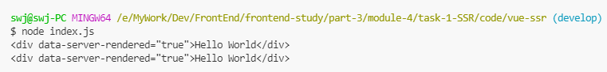

### 与服务器集成

```js
npm i express
```

> [../code/vue-ssr/server.js](../code/vue-ssr/server.js)

```js
const Vue = require('vue');
const server = require('express')();
const renderer = require('vue-server-renderer').createRenderer();

server.get('*', (req, res) => {
  const app = new Vue({
    data: {
      url: req.url,
    },
    template: `<div>访问的 URL 是： {{ url }}</div>`,
  });

  renderer.renderToString(app, (err, html) => {
    if (err) {
      res.status(500).end('Internal Server Error');
      return;
    }
    res.end(`
<!DOCTYPE html>
<html lang="en">
<head>
<title>Hello</title>
<meta charset="UTF-8">
</head>
<body>${html}</body>
</html>
`);
  });
});

server.listen(8080);
```

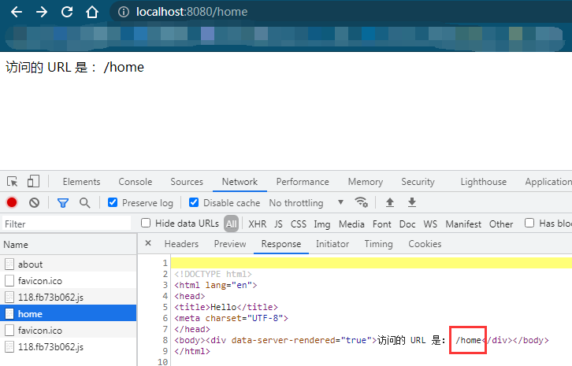
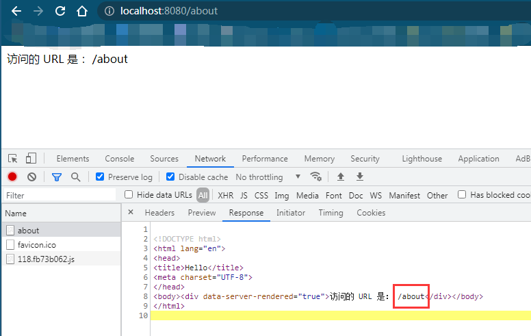

### 使用一个页面模板

> [../code/vue-ssr/index.template.html](../code/vue-ssr/index.template.html):

> [\<!--vue-ssr-outlet--\>](https://ssr.vuejs.org/zh/guide/#%E4%BD%BF%E7%94%A8%E4%B8%80%E4%B8%AA%E9%A1%B5%E9%9D%A2%E6%A8%A1%E6%9D%BF)

> [模板插值](https://ssr.vuejs.org/zh/guide/#%E6%A8%A1%E6%9D%BF%E6%8F%92%E5%80%BC)：
> 可以通过传入一个"渲染上下文对象"，作为 renderToString 函数的第二个参数，来提供插值数据

```html
<!DOCTYPE html>
<html lang="en">
  <head>
    <title>{{ title }}</title>
    <meta charset="UTF-8" />
  </head>
  <body>
    <!--vue-ssr-outlet-->
  </body>
</html>
```

```js
const Vue = require('vue');
const server = require('express')();
const fs = require('fs');

const renderer = require('vue-server-renderer').createRenderer({
  template: fs.readFileSync('./index.template.html', 'utf-8'),
});

server.get('*', (req, res) => {
  const app = new Vue({
    data: {
      url: req.url,
    },
    template: `<div>访问的 URL 是： {{ url }}</div>`,
  });

  const context = {
    title: '哈哈哈',
  };
  renderer.renderToString(app, context, (err, html) => {
    if (err) {
      res.status(500).end('Internal Server Error');
      return;
    }

    res.setHeader('Content-Type', 'text/html; charset=utf8');
    // res.end(html);

    //     res.end(`
    // <!DOCTYPE html>
    // <html lang="en">
    // <head>
    // <title>Hello</title>
    // <meta charset="UTF-8">
    // </head>
    // <body>${html}</body>
    // </html>
    //     `);

    res.end(html);
  });
});

server.listen(8080);
```

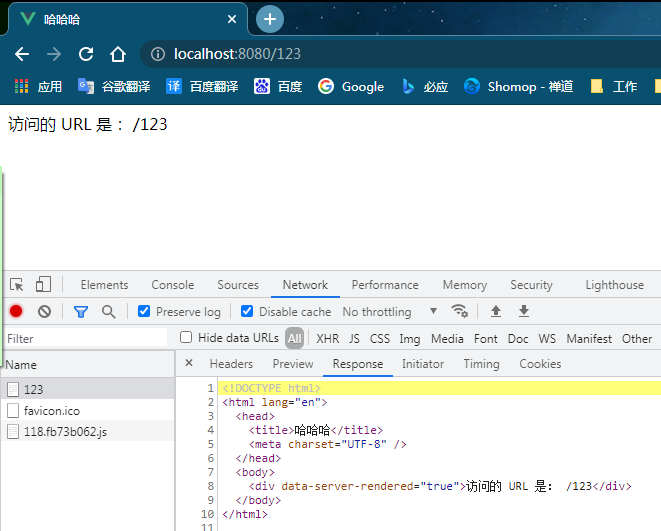

---

## 构建同构渲染

### 构建流程


### [源码结构](https://ssr.vuejs.org/zh/guide/structure.html)

我们需要使用 webpack 来打包我们的 Vue 应用程序。事实上，我们可能需要在服务器上使用
webpack 打包 Vue 应用程序，因为：

- 通常 Vue 应用程序是由 webpack 和 `vue-loader` 构建，并且许多 webpack 特定功能不能直接在 Node.js 中运行（例如通过 `file-loader` 导入文件，通过 `css-loader` 导入 CSS）。
- 尽管 Node.js 最新版本能够完全支持 ES2015 特性，我们还是需要转译客户端代码以适应老版浏览器。这也会涉及到构建步骤。

所以基本看法是，对于客户端应用程序和服务器应用程序，我们都要使用 webpack 打包 - 服务器需要「服务器 bundle」然后用于服务器端渲染(SSR)，而「客户端 bundle」会发送给浏览器，用于混合静态标记。

现在我们正在使用 webpack 来处理服务器和客户端的应用程序，大部分源码可以使用通用方式编写，可以使用 webpack 支持的所有功能。同时，在编写通用代码时，有一些[事项](https://ssr.vuejs.org/zh/guide/universal.html)要牢记在心。

[项目基本结构](../code/vue-ssr)

```sh
src
├── components
│   ├── Foo.vue
│   ├── Bar.vue
│   └── Baz.vue
├── App.vue
├── app.js # 通用 entry(universal entry)
├── entry-client.js # 仅运行于浏览器
└── entry-server.js # 仅运行于服务器
```

- [app.js](../code/vue-ssr/src/app.js)

  app.js 是我们应用程序的「通用 entry」。在纯客户端应用程序中，我们将在此文件中创建根 Vue 实例，并直接挂载到 DOM。但是，对于服务器端渲染(SSR)，责任转移到纯客户端 entry 文件。 app.js 简单地使用 export 导出一个 `createApp` 函数：

  ```js
  import Vue from 'vue';
  import App from './App.vue';

  // 导出一个工厂函数，用于创建新的
  // 应用程序、router 和 store 实例
  export function createApp() {
    const app = new Vue({
      // 根实例简单的渲染应用程序组件。
      render: (h) => h(App),
    });
    return { app };
  }
  ```

- [entry-client.js](../code/vue-ssr/src/entry-client.js)

  客户端 entry 只需创建应用程序，并且将其挂载到 DOM 中

  ```js
  import { createApp } from './app';

  // 客户端特定引导逻辑……

  const { app } = createApp();

  // 这里假定 App.vue 模板中根元素具有 `id="app"`
  app.$mount('#app');
  ```

- [entry-server.js](../code/vue-ssr/src/entry-server.js)

  服务器 entry 使用 default export 导出函数，并在每次渲染中重复调用此函数。此时，除了创建和返回应用程序实例之外，它不会做太多事情 - 但是稍后我们将在此执行服务器端路由匹配 (server-side route matching) 和数据预取逻辑 (data pre-fetching logic)。

  ```js
  import { createApp } from './app';

  export default (context) => {
    const { app } = createApp();
    return app;
  };
  ```

- [server.js](../code/vue-ssr/server.js): 通用应用 Web 服务启动脚本
- [index.template.html](../code/vue-ssr/index.template.html): 页面模板

### 构建配置

#### 安装依赖

- 安装生产依赖

```sh
npm i vue vue-server-renderer express cross-env
```

| 包                  | 说明                                |
| :------------------ | :---------------------------------- |
| vue                 | Vue.js 核心库                       |
| vue-server-renderer | Vue 服务端渲染工具                  |
| express 基于        | Node 的 Web 服务框架                |
| cross-env           | 通过 npm scripts 设置跨平台环境变量 |

- 安装开发依赖

```sh
npm i -D webpack webpack-cli webpack-merge webpack-node-externals @babel/core @babel/plugin-transform-runtime @babel/preset-env babel-loader css-loader url-loader file-loader rimraf vue-loader vue-template-compiler friendly-errors-webpack-plugin
```

| 包                                                                                        | 说明                                   |
| :---------------------------------------------------------------------------------------- | :------------------------------------- |
| webpack                                                                                   | webpack 核心包                         |
| webpack-cli                                                                               | webpack 的命令行工具                   |
| webpack-merge                                                                             | webpack 配置信息合并工具               |
| webpack-node-externals                                                                    | 排除 webpack 中的 Node 模块            |
| rimraf                                                                                    | 基于 Node 封装的一个跨平台 rm -rf 工具 |
| friendly-errors-webpack-plugin                                                            | 友好的 webpack 错误提示                |
| @babel/core <br> @babel/plugin-transform-runtime <br> @babel/preset-env <br> babel-loader | Babel 相关工具                         |
| vue-loader <br> vue-template-compiler                                                     | 处理 .vue 资源                         |
| file-loader                                                                               | 处理字体资源                           |
| css-loader                                                                                | 处理 CSS 资源                          |
| url-loader                                                                                | 处理图片资源                           |

#### 配置文件及打包命令

- 初始化 webpack 打包配置文件

  - ```sh
    build
    ├── webpack.base.config.js # 公共配置
    ├── webpack.client.config.js # 客户端打包配置文件
    └── webpack.server.config.js # 服务端打包配置文件
    ```
  - [webpack.base.config.js](../code/vue-ssr/build/webpack.base.config.js)
  - [webpack.client.config.js](../code/vue-ssr/build/webpack.client.config.js)
  - [webpack.server.config.js](../code/vue-ssr/build/webpack.server.config.js)

- 在 npm scripts 中配置打包命令

```json
{
  "scripts": {
    "build:client": "cross-env NODE_ENV=production webpack --config build/webpack.client.config.js",
    "build:server": "cross-env NODE_ENV=production webpack --config build/webpack.server.config.js",
    "build": "rimraf dist && npm run build:client && npm run build:server"
  }
}
```

#### [启动应用](https://ssr.vuejs.org/zh/guide/bundle-renderer.html)

- [传入 BundleRenderer](https://ssr.vuejs.org/zh/guide/bundle-renderer.html#%E4%BC%A0%E5%85%A5-bundlerenderer)

```js
const serverBundle = require('./dist/vue-ssr-server-bundle.json');
const template = fs.readFileSync('./index.template.html', 'utf-8');
const clientManifest = require('./dist/vue-ssr-client-manifest.json');

const renderer = require('vue-server-renderer').createBundleRenderer(
  serverBundle,
  {
    template,
    clientManifest,
  }
);
```

```js
const app = express();

app.use('/dist', express.static(path.join(__dirname, './dist')));

app.get('*', (req, res) => {
  const context = {
    title: '哈哈哈',
  };
  renderer.renderToString(context, (err, html) => {
    if (err) {
      res.status(500).end('Internal Server Error');
      return;
    }

    res.setHeader('Content-Type', 'text/html; charset=utf8');
    res.end(html);
  });
});
```

#### 解析渲染流程

（1）服务端渲染

- renderer.renderToString 渲染了什么？
- renderer 是如何拿到 entry-server 模块的？
  - createBundleRenderer 中的 serverBundle
- server Bundle 是 Vue SSR 构建的一个特殊的 JSON 文件: [./dist/vue-ssr-server-bundle.json](../code/vue-ssr/dist/vue-ssr-server-bundle.json)
  - entry：入口
  - files：所有构建结果资源列表
  - maps：源代码 source map 信息
- server-bundle.js 就是通过 server.entry.js 构建出来的结果文件
- 最终把渲染结果注入到模板中

（2）客户端渲染

- vue-ssr-client-manifest.json
  - publicPath：访问静态资源的根相对路径，与 webpack 配置中的 publicPath 一致
  - all：打包后的所有静态资源文件路径
  - initial：页面初始化时需要加载的文件，会在页面加载时配置到 preload 中
  - async：页面跳转时需要加载的文件，会在页面加载时配置到 prefetch 中
  - modules：项目的各个模块包含的文件的序号，对应 all 中文件的顺序；moduleIdentifier 和 all 数组中文件的映射关系（modules 对象是我们查找文件引用的重要数据）

> [客户端激活 (client-side hydration)](https://ssr.vuejs.org/zh/guide/hydration.html)

#### 构建开发模式

下面来实现项目中的开发模式构建，也就是我们希望能够实现：

- 写完代码，自动构建
- 自动重启 Web 服务
- 自动刷新页面内容
- ...

##### 基本思路

- 生产模式
  - `npm run build` 构建
  - `node server.js` 启动应用
- 开发模式
  - 监视代码变动自动构建，热更新等功能
  - `node server.js` 启动应用
- 启动脚本

  ```json
  {
    "scripts": {
      "dev": "node server",
      "start": "cross-env NODE_ENV=production && node server.js"
    }
  }
  ```

- 服务端配置：[vue-ssr/server.js](../code/vue-ssr/server.js)

  ```js
  const express = require('express');
  const fs = require('fs');
  const path = require('path');
  const { createBundleRenderer } = require('vue-server-renderer');

  const port = 3000;
  const nodeEnv = process.env.NODE_ENV;
  const isDev = nodeEnv === 'development';
  const templatePath = './index.template.html';
  let renderer;

  if (!isDev) {
    const serverBundle = require('./dist/vue-ssr-server-bundle.json');
    const template = fs.readFileSync(templatePath, 'utf-8');
    const clientManifest = require('./dist/vue-ssr-client-manifest.json');
    renderer = createBundleRenderer(serverBundle, {
      runInNewContext: false,
      template,
      clientManifest,
    });
  } else {
    // 开发模式
    // 打包构建（客户端 + 服务端） -> 创建渲染器
    // ...
  }

  const app = express();

  app.use('/dist', express.static(path.join(__dirname, './dist')));
  app.use(express.static(path.join(__dirname, './static')));

  async function render(req, res) {
    const context = { url: req.url };

    // 这里无需传入一个应用程序，因为在执行 bundle 时已经自动创建过。
    // 现在我们的服务器与应用程序已经解耦！
    // bundle renderer 在调用 renderToString 时，
    // 它将自动执行「由 bundle 创建的应用程序实例」所导出的函数（传入上下文作为参数），然后渲染它。
    try {
      const html = await renderer.renderToString(context);
      res.send(html);
    } catch (err) {
      res.status(500).end(err.message);
    }
  }

  app.get(
    '*',
    !isDev
      ? render // 生产模式：使用构建好的包直接渲染
      : (req, res) => {
          // 开发模式：等编译构建好再渲染
          // ...
        }
  );

  app.listen(port, () =>
    console.log(`server running in ${nodeEnv} mode on http://localhost:${port}`)
  );
  ```

##### 封装处理模块

> [vue-ssr/build/setup-dev-server.js](../code/vue-ssr/build/setup-dev-server.js)

```js
module.exports = function (app, templatePath, cb) {
  let ready;
  const onReady = new Promise((resolve) => (ready = resolve));

  let serverBundle;
  let clientManifest;
  let template;

  const update = () => {
    if (template && serverBundle && clientManifest) {
      // 构建完毕，通知 server 可以 render 渲染了
      ready();

      // 更新 server 中的 Renderer
      cb(serverBundle, {
        template,
        clientManifest,
      });
    }
  };

  // 监视构建 template，调用 update 更新 Renderer
  // 监视构建 serverBundle，调用 update 更新 Renderer
  // 监视构建 clientManifest，调用 update 更新 Renderer
  return onReady;
};
```

> [vue-ssr/server.js](../code/vue-ssr/server.js)

```js
const express = require('express');
const fs = require('fs');
const path = require('path');
const { createBundleRenderer } = require('vue-server-renderer');

const app = express();

app.use('/dist', express.static(path.join(__dirname, './dist')));
app.use(express.static(path.join(__dirname, './static')));

const port = 3000;
const nodeEnv = process.env.NODE_ENV;
const isDev = nodeEnv === 'development';
const templatePath = './index.template.html';

let renderer;
let onReady;
if (!isDev) {
  const serverBundle = require('./dist/vue-ssr-server-bundle.json');
  const template = fs.readFileSync(templatePath, 'utf-8');
  const clientManifest = require('./dist/vue-ssr-client-manifest.json');
  renderer = createBundleRenderer(serverBundle, {
    runInNewContext: false,
    template,
    clientManifest,
  });
} else {
  // 开发模式
  // 打包构建（客户端 + 服务端） -> 创建渲染器
  // ↓
  // 创建渲染器
  // 模板 + 客户端 bundle + 服务端 bundle
  // 改变 -> 重新生成渲染器
  // 源码改变 -> 打包客户端 Bundle + 服务端 Bundle
  // onReady 是一个 Promise,当它完成的时候意味着初始构建已完成
  onReady = require('./build/setup-dev-server')(
    app,
    templatePath,
    (serverBundle, options) => {
      // 该回调函数是重复调用的
      // 每当生成新的 template、客户端 bundle、服务端 bundle 都会重新生成新的渲染器
      renderer = createBundleRenderer(serverBundle, {
        runInNewContext: false,
        ...options,
      });
    }
  );
}

async function render(req, res) {
  const context = { url: req.url };

  // 这里无需传入一个应用程序，因为在执行 bundle 时已经自动创建过。
  // 现在我们的服务器与应用程序已经解耦！
  // bundle renderer 在调用 renderToString 时，
  // 它将自动执行「由 bundle 创建的应用程序实例」所导出的函数（传入上下文作为参数），然后渲染它。
  try {
    const html = await renderer.renderToString(context);
    res.send(html);
  } catch (err) {
    res.status(500).end(err.message);
  }
}

app.get(
  '*',
  !isDev
    ? render // 生产模式：使用构建好的包直接渲染
    : async (req, res) => {
        // 开发模式：等第一次构建好再渲染
        await onReady;
        render(req, res);
      }
);

app.listen(port, () =>
  console.log(`server running in ${nodeEnv} mode on http://localhost:${port}`)
);
```

##### 更新模板

关于 Node 中的监视的问题：

- fs.watch
- fs.watchFile
- 第三方包：[chokidar](https://github.com/paulmillr/chokidar)

> [vue-ssr/build/setup-dev-server.js](../code/vue-ssr/build/setup-dev-server.js)

```js
// 监视构建 template，调用 update 更新 Renderer
template = fs.readFileSync(templatePath, 'utf-8');
update();
chokidar.watch(templatePath).on('change', () => {
  template = fs.readFileSync(templatePath, 'utf-8');
  console.log('template updated.');
  update();
});
```

##### 更新服务端打包

> [vue-ssr/build/setup-dev-server.js](../code/vue-ssr/build/setup-dev-server.js)

```js
// 监视服务端打包构建
// 监视构建 serverBundle，调用 update 更新 Renderer
const serverConfig = require('./webpack.server.config');
const serverCompiler = webpack(serverConfig);
serverCompiler.watch(
  {
    // 监视打包的可选配置参数
  },
  (err, stats) => {
    // console.log('err => ', err)
    // console.log('stats => ', stats)
    if (err) throw err;
    if (stats.hasErrors()) return;
    // read bundle generated by vue-ssr-webpack-plugin
    serverBundle = JSON.parse(
      fs.readFileSync('./dist/vue-ssr-server-bundle.json', 'utf-8')
    );

    // 更新 Renderer
    update();
    console.log('success');
  }
);
```

##### 将打包结果存储到内存中

> [vue-ssr/build/setup-dev-server.js](../code/vue-ssr/build/setup-dev-server.js)

webpack 默认会把构建结果存储到磁盘中，对于生产模式构建来说是没有问题的；但是我们在开发模
式中会频繁的修改代码触发构建，也就意味着要频繁的操作磁盘数据，而磁盘数据操作相对于来说是比
较慢的，所以我们有一种更好的方式，就是把数据存储到内存中，这样可以极大的提高构建的速度。

[memfs](https://github.com/streamich/memfs) 是一个兼容 Node 中 fs 模块 API 的内存文件系统，通过它我们可以轻松的实现把 webpack 构建结果输出到内存中进行管理。

- 方案一：自己配置 memfs。
  ```js
  const { createFsFromVolume, Volume } = require('memfs')
  // 自定义 webpack 把数据写入内存中
  serverCompiler.outputFileSystem = createFsFromVolume(new Volume())
  // memfs 模块去除了 join 方法，所以这里我们需要手动的给它提供 join 方法
  serverCompiler.outputFileSystem.join = path.join.bind(path)
  serverCompiler.watch({
   // 监视构建的配置选项
  }, (err, stats) => {
   // 每当构建成功，就会执行该回调函数
   if (err) {
    throw err
  }
   if (stats.hasErrors()) {
    return
  }
   // 读取打包之后的最新结果
   serverBundle =
  JSON.parse(serverCompiler.outputFileSystem.readFileSync(resolve('../dist/vue-
  ssr-server-bundle.json'), 'utf-8'))
   // update 更新
   update()
  })
  ```
- 方案二：使用 [webpack-dev-middleware](https://github.com/webpack/webpack-dev-middleware)。
  webpack-dev-middleware 作用是，以监听模式启动 webpack，将编译结果输出到内存中，然后将内
  存文件输出到 Express 服务中。

  安装依赖：

  ```ssh
  npm i -D webpack-dev-middleware
  ```

  配置到构建流程中：

  ```js
  // 监视构建 serverBundle -> 调用 update -> 更新 Renderer 渲染器
  const serverConfig = require('./webpack.server.config');
  const serverCompiler = webpack(serverConfig);
  webpackDevMiddleware(serverCompiler, {
    // logLevel: 'silent', // 关闭日志输出，由 FriendlyErrorsWebpackPlugin 处理
    // { mimeTypes?, writeToDisk?, methods?, headers?, publicPath?, stats?, serverSideRender?, outputFileSystem?, index? }
  });
  serverCompiler.hooks.done.tap('server', () => {
    serverBundle = JSON.parse(
      serverCompiler.outputFileSystem.readFileSync(
        resolve('../dist/vue-ssr-server-bundle.json'),
        'utf-8'
      )
    );
    // console.log(serverBundle)
    update();
  });

  // serverCompiler.watch(
  //   {
  //     // 监视打包的可选配置参数
  //   },
  //   (err, stats) => {
  //     // console.log('err => ', err)
  //     // console.log('stats => ', stats)
  //     if (err) throw err;
  //     if (stats.hasErrors()) return;
  //     // read bundle generated by vue-ssr-webpack-plugin
  //     serverBundle = JSON.parse(
  //       fs.readFileSync('./dist/vue-ssr-server-bundle.json', 'utf-8')
  //     );

  //     // 更新 Renderer
  //     update();
  //     // console.log('success');
  //   }
  // );
  ```

  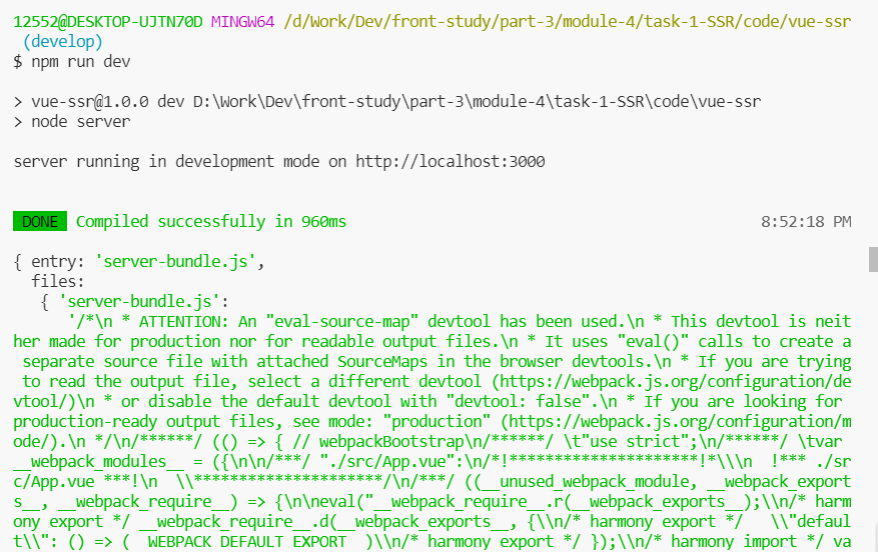

##### 更新客户端打包

> [vue-ssr/build/setup-dev-server.js](../code/vue-ssr/build/setup-dev-server.js)

```js
// 监视构建 serverBundle -> 调用 update -> 更新 Renderer 渲染器
const clientConfig = require('./webpack.client.config');
const clientCompiler = webpack(clientConfig);
webpackDevMiddleware(clientCompiler, {
  publicPath: clientConfig.output.publicPath, // 重要！输出资源的访问路径前缀，应该和客户端打包输出的 publicPath 一致
  // logLevel: 'silent',
});
clientCompiler.hooks.done.tap('client', () => {
  clientManifest = JSON.parse(
    clientCompiler.outputFileSystem.readFileSync(
      resolve('../dist/vue-ssr-client-manifest.json'),
      'utf-8'
    )
  );
  update();
});

// ! 重要！将内存中的资源通过 Express 中间件对外公开访问
server.use(clientDevMiddleware);
```

##### 热更新

热更新功能需要使用到 [webpack-hot-middleware](https://github.com/webpack-contrib/webpack-hot-middleware) 工具包。
安装依赖：

```ssh
npm install --save-dev webpack-hot-middleware
```

> [vue-ssr/build/setup-dev-server.js](../code/vue-ssr/build/setup-dev-server.js)

```js
const hotMiddleware = require('webpack-hot-middleware');
// 监视构建 serverBundle -> 调用 update -> 更新 Renderer 渲染器
const clientConfig = require('./webpack.client.config');
// ====================== 热更新配置 ============================
clientConfig.plugins.push(new webpack.HotModuleReplacementPlugin());
clientConfig.entry.app = [
  'webpack-hot-middleware/client?reload=true&noInfo=true',
  clientConfig.entry.app,
];
clientConfig.output.filename = '[name].js'; // 热更新模式下确保一致的hash或者不设置hash
// ======================== /热更新配置 ==========================
const clientCompiler = webpack(clientConfig);
clientDevMiddleware = webpackDevMiddleware(clientCompiler, {
  publicPath: clientConfig.output.publicPath,
  // logLevel: 'silent',
});
clientCompiler.hooks.done.tap('client', () => {
  clientManifest = JSON.parse(
    clientCompiler.outputFileSystem.readFileSync(
      resolve('../dist/vue-ssr-client-manifest.json'),
      'utf-8'
    )
  );
  update();
});
server.use(clientDevMiddleware);
// 挂载热更新的中间件
server.use(
  hotMiddleware(clientCompiler, {
    log: false,
  })
);
```

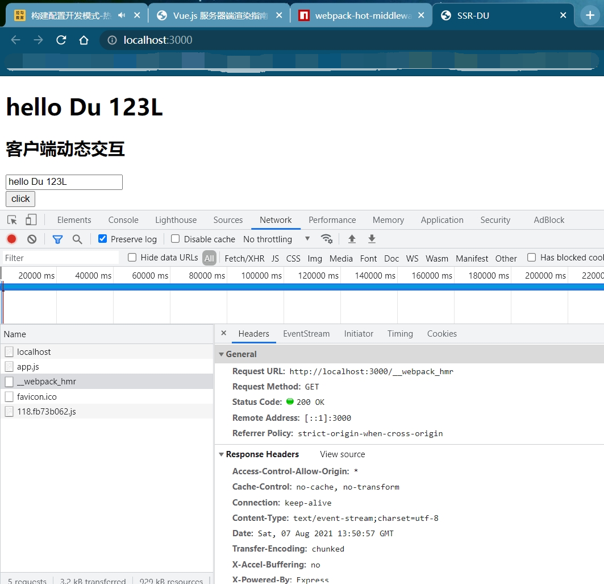

###### 工作原理：

- 中间件将自身安装为 webpack 插件，并侦听编译器事件。
- 每个连接的客户端都有一个 Server Sent Events 连接，服务器将在编译器事件上向连接的客户端发布通知。
  - MDN - [使用服务器发送事件](https://developer.mozilla.org/zh-CN/docs/Web/API/Server-sent_events/Using_server-sent_events)
  - [Server-Sent Events 教程](http://www.ruanyifeng.com/blog/2017/05/server-sent_events.html)
- 当客户端收到消息时，它将检查本地代码是否为最新。如果不是最新版本，它将触发 webpack 热模块重新加载。

---

## 编写通用代码

我们现在终于把实现 Vue SSR 同构应用的基础环境搭建起来了，虽然还有很多不足之处，但是也能满足我们当前的基本使用了。

所以接下来我们就要把内容的核心转移到 Vue SSR 本身上了，那首先我们来了解一下编写通用应用的注意事项，通过了解这些注意事项对于如何正确的使用 Vue SSR 是非常有帮助的。

在这些注意事项中，有些其实已经在前面的学习过程中了解过了，而有些还没有接触过，所以在这里通过官方文档做一个简单的总结。

### 服务器上的数据响应

在纯客户端应用程序 (client-only app) 中，每个用户会在他们各自的浏览器中使用新的应用程序实例。对于服务器端渲染，我们也希望如此：每个请求应该都是全新的、独立的应用程序实例，以便不会有交叉请求造成的状态污染(cross-request state pollution)。

因为实际的渲染过程需要确定性，所以我们也将在服务器上“预取”数据 ("pre-fetching" data) - 这意味着在我们开始渲染时，我们的应用程序就已经解析完成其状态。也就是说，将数据进行响应式的过程在服务器上是多余的，所以默认情况下禁用。禁用响应式数据，还可以避免将「数据」转换为「响应式对象」的性能开销。

### 组件生命周期钩子函数

由于没有动态更新，所有的生命周期钩子函数中，只有 `beforeCreate` 和 `created` 会在服务器端渲染(SSR) 过程中被调用。这就是说任何其他生命周期钩子函数中的代码（例如 `beforeMount` 或 `mounted` ），只会在客户端执行。

此外还需要注意的是，你应该**避免在 `beforeCreate` 和 `created` 生命周期时产生全局副作用的代码**，例如在其中使用 `setInterval` 设置 timer。在纯客户端 (client-side only) 的代码中，我们可以设置一个 timer，然后在 `beforeDestroy` 或 `destroyed` 生命周期时将其销毁。但是，由于在 SSR 期间并不会调用销毁钩子函数，所以 timer 将永远保留下来。为了避免这种情况，请将副作用代码移动到 `beforeMount` 或 `mounted` 生命周期中。

### 访问特定平台(Platform-Specific) API

通用代码不可接受特定平台的 API，因此如果你的代码中，直接使用了像 `window` 或 `document` ，这种
仅浏览器可用的全局变量，则会在 Node.js 中执行时抛出错误，反之也是如此。

对于共享于服务器和客户端，但用于不同平台 API 的任务(task)，建议将平台特定实现包含在通用 API
中，或者使用为你执行此操作的 library。例如，axios 是一个 HTTP 客户端，可以向服务器和客户端都
暴露相同的 API。

对于仅浏览器可用的 API，通常方式是，**在「纯客户端 (client-only)」的生命周期钩子函数中惰性访问
(lazily access) 它们**。

请注意，考虑到如果第三方 library 不是以上面的通用用法编写，则将其集成到服务器渲染的应用程序
中，可能会很棘手。你可能要通过模拟 (mock) 一些全局变量来使其正常运行，但这只是 hack 的做
法，并且可能会干扰到其他 library 的环境检测代码。

### 区分运行环境

> 参考 [https://webpack.js.org/plugins/define-plugin/](https://webpack.js.org/plugins/define-plugin/)

```js
new webpack.DefinePlugin({
  'process.client': true,
  'process.server': false,
});
```

### 自定义指令

大多数自定义指令直接操作 DOM，因此会在服务器端渲染 (SSR) 过程中导致错误。有两种方法可以解
决这个问题：

1. 推荐使用组件作为抽象机制，并运行在「虚拟 DOM 层级(Virtual-DOM level)」（例如，使用渲染
   函数(render function)）。
2. 如果你有一个自定义指令，但是不是很容易替换为组件，则可以在创建服务器 renderer 时，使用
   [directives](https://ssr.vuejs.org/zh/api/#directives) 选项所提供"服务器端版本(server-side version)"。

---

## [路由和代码分割](https://ssr.vuejs.org/zh/guide/routing.html#%E4%BD%BF%E7%94%A8-vue-router-%E7%9A%84%E8%B7%AF%E7%94%B1)

> [vue-router](https://router.vuejs.org/zh/installation.html)

> [vue-ssr/src/router/index.js](../code/vue-ssr/src/router/index.js)

```js
import Vue from 'vue';
import Router from 'vue-router';
import { routers } from './router';

Vue.use(Router);

export function createRouter() {
  return new Router({
    mode: 'history',
    routes: routers,
  });
}
```

> [vue-ssr/src/app.js](../code/vue-ssr/src/app.js)：把路由挂载到 Vue 根实例中

```js
/**
 * 通用启动入口
 */
import Vue from 'vue';
import App from './App.vue';
import { createRouter } from './router/';

Vue.config.devtools = true;

// 导出一个工厂函数，用于创建新的应用程序、router 和 store 实例
export function createApp() {
  const router = createRouter();
  const app = new Vue({
    router, // 把路由挂载到 Vue 根实例中
    // 根实例简单的渲染应用程序组件。
    render: (h) => h(App),
  });
  return { router, app };
}
```

> [vue-ssr/src/entry-server.js](../code/vue-ssr/src/entry-server.js)：路由处理-适配服务端入口

```js
/**
 * 服务端入口：渲染/路由匹配/数据预取
 */
import { createApp } from './app';

export default (context) => {
  // 因为有可能会是异步路由钩子函数或组件，所以我们将返回一个 Promise，
  // 以便服务器能够等待所有的内容在渲染前，就已经准备就绪。
  return new Promise((resolve, reject) => {
    const { app, router } = createApp();

    // 设置服务器端 router 的位置
    router.push(context.url);

    // 等到 router 将可能的异步组件和钩子函数解析完
    router.onReady(() => {
      const matchedComponents = router.getMatchedComponents();
      // 匹配不到的路由，执行 reject 函数，并返回 404
      if (!matchedComponents.length) {
        // eslint-disable-next-line prefer-promise-reject-errors
        return reject({ code: 404 });
      }

      // Promise 应该 resolve 应用程序实例，以便它可以渲染
      resolve(app);
    }, reject);
  });
};
```

> [vue-ssr/server.js](../code/vue-ssr/server.js)：路由处理-服务端 server 适配

```js
async function render(req, res) {
  const context = { title: 'SSR-DU', url: req.url };

  // 这里无需传入一个应用程序，因为在执行 bundle 时已经自动创建过。
  // 现在我们的服务器与应用程序已经解耦！
  // bundle renderer 在调用 renderToString 时，
  // 它将自动执行「由 bundle 创建的应用程序实例」所导出的函数（传入上下文作为参数），然后渲染它。
  try {
    const html = await renderer.renderToString(context);
    res.send(html);
  } catch (err) {
    res.status(500).end(err.message);
  }
}

app.get(
  '*',
  !isDev
    ? render // 生产模式：使用构建好的包直接渲染
    : async (req, res) => {
        // 开发模式：等第一次构建好再渲染
        await onReady;
        render(req, res);
      }
);
```

> [vue-ssr/src/entry-client.js](../code/vue-ssr/src/entry-client.js)：路由处理-适配客户端入口

```js
/**
 * 客户端入口
 */
import { createApp } from './app';

// 客户端特定引导逻辑……

const { app, router } = createApp();

router.onReady(() => {
  // 这里假定 App.vue 模板中根元素具有 `id="app"`
  app.$mount('#app');
});
```

### 测试路由

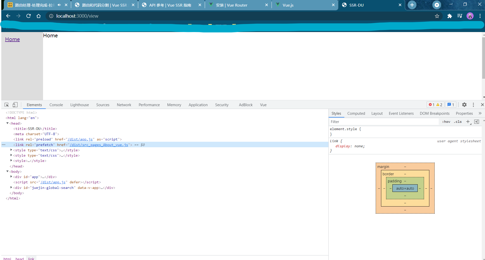
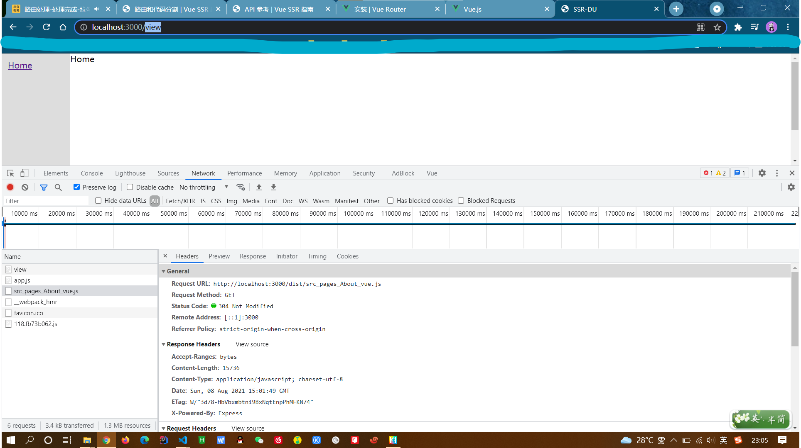
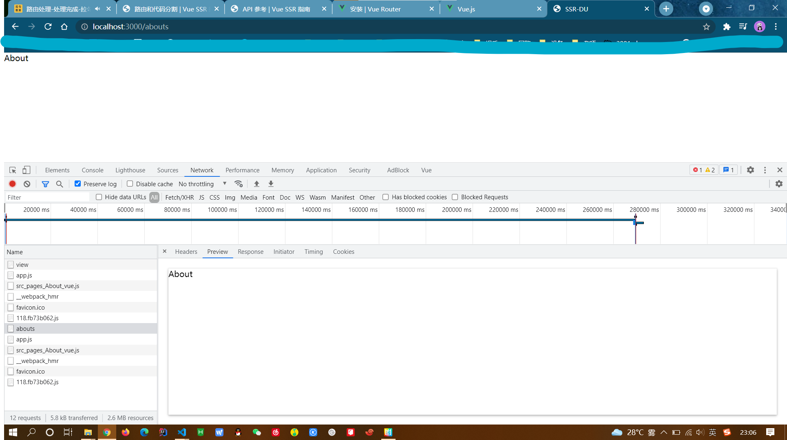

---

## 管理页面 Head

> [SSR-Head 管理](https://ssr.vuejs.org/zh/guide/head.html): `this.$ssrContext.title` / `document.title`

可以编写一个简单的 mixin 来完成标题管理：

```js
// title-mixin.js

function getTitle(vm) {
  // 组件可以提供一个 `title` 选项
  // 此选项可以是一个字符串或函数
  const { title } = vm.$options;
  if (title) {
    return typeof title === 'function' ? title.call(vm) : title;
  }
}

const serverTitleMixin = {
  created() {
    const title = getTitle(this);
    if (title) {
      this.$ssrContext.title = title;
    }
  },
};

const clientTitleMixin = {
  mounted() {
    const title = getTitle(this);
    if (title) {
      document.title = title;
    }
  },
};

// 可以通过 `webpack.DefinePlugin` 注入 `VUE_ENV`
export default process.env.VUE_ENV === 'server'
  ? serverTitleMixin
  : clientTitleMixin;
```

现在，路由组件可以利用以上 mixin，来控制文档标题 (document title)：

```js
// Item.vue
export default {
  mixins: [titleMixin],
  title() {
    return this.item.title;
  },

  asyncData({ store, route }) {
    return store.dispatch('fetchItem', route.params.id);
  },

  computed: {
    item() {
      return this.$store.state.items[this.$route.params.id];
    },
  },
};
```

然后模板中的内容将会传递给 bundle renderer：

```html
<html>
  <head>
    <title>{{ title }}</title>
  </head>
  <body>
    ...
  </body>
</html>
```

注意：

- 使用双花括号(double-mustache)进行 HTML 转义插值(HTML-escaped interpolation)，以避免 XSS 攻击。
- 你应该在创建 context 对象时提供一个默认标题，以防在渲染过程中组件没有设置标题。

> [vue-meta](https://github.com/nuxt/vue-meta): 只需在页面组件中使用 `metaInfo` 属性配置页面的 head 内容即可

```html
<template> ... </template>
<script>
  export default {
    metaInfo: {
      title: 'My Example App',
      titleTemplate: '%s - Yay!',
      htmlAttrs: {
        lang: 'en',
        amp: true,
      },
    },
  };
</script>
```

页面渲染出来的结果：

```html
<html lang="en" amp>
  <head>
    <title>My Example App - Yay!</title>
    ...
  </head>
</html>
```

安装：`npm i vue-meta`
在通用入口中通过插件的方式将 vue-meta 注册到 Vue 中：

```js
import Vue from 'vue';
import VueMeta from 'vue-meta';

Vue.use(VueMeta);

Vue.mixin({
  metaInfo: {
    titleTemplate: '%s - 拉勾教育',
  },
});
```

然后在服务端渲染入口模块中适配 vue-meta：

```js
// entry-server.js
import { createApp } from './app';
export default async (context) => {
  // 因为有可能会是异步路由钩子函数或组件，所以我们将返回一个 Promise，
  // 以便服务器能够等待所有的内容在渲染前，
  // 就已经准备就绪。
  const { app, router } = createApp();
  const meta = app.$meta();
  // 设置服务器端 router 的位置
  router.push(context.url);
  context.meta = meta;
  // 等到 router 将可能的异步组件和钩子函数解析完
  await new Promise(router.onReady.bind(router));
  return app;
};
```

最后在模板页面中注入 meta 信息：

```html
<head>
  {{{ meta.inject().title.text() }}} {{{ meta.inject().meta.text() }}}
</head>
```

下面就是直接在组件中使用即可：Home.vue

```js
{
  metaInfo: {
    title: '首页'; // 首页 - 拉勾教育
  }
}
```

About.vue

```js
{
  metaInfo: {
    title: 'About'; // About - 拉勾教育
  }
}
```

---

## [数据预取和状态](https://ssr.vuejs.org/zh/guide/data.html)

我们的需求是：

- 已知有一个数据接口，接口返回一个文章列表数据
- 我们想要通过服务端渲染的方式来把异步接口数据渲染到页面中

这个需求看起来是不是很简单呢？无非就是在页面发请求拿数据，然后在模板中遍历出来，如果是纯客户端渲染的话确实就是这样的，但是想要通过服务端渲染的方式来处理的话就比较麻烦了。

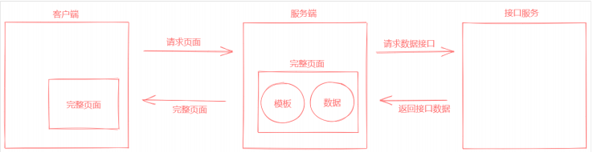

也就是说我们要在服务端获取异步接口数据，交给 Vue 组件去渲染。

我们首先想到的肯定是在组件的生命周期钩子中请求获取数据渲染页面，那我们可以顺着这个思路来试
一下。

在组件中添加生命周期钩子，`beforeCreate` 和 `created`，服务端渲染仅支持这两个钩子函数的调用。

然后下一个问题是如何在服务端发送请求？依然使用 axios，axios 既可以运行在客户端也可以运行在
服务端，因为它对不同的环境做了适配处理，在客户端是基于浏览器的 XMLHttpRequest 请求对象，
在服务端是基于 Node.js 中的 http 模块实现，无论是底层是什么，上层的使用方式都是一样的。

```js
// 服务端渲染
// 只支持 beforeCreate 和 created
// 不会等待 beforeCreate 和 created 中的异步操作
// 不支持响应式数据
// async created () {
//   const { data } = await axios({
//   method: 'GET',
//     url: 'https://cnodejs.org/api/v1/topics'
//   })
//   this.posts = data.data
// }
```

通过官方文档我们可以看到，它的核心思路就是把在服务端渲染期间获取的数据存储到 Vuex 容器中，
然后把容器中的数据同步到客户端，这样就保持了前后端渲染的数据状态同步，避免了客户端重新渲染
的问题。

以接下来要做的第一件事儿就是把 Vuex 容器创建出来。

- （1）通过 Vuex 创建容器实例，并挂载到 Vue 根实例

  安装 Vuex：`npm i vuex`

  创建 Vuex 容器：[vue-ssr/store/index.js](../code/vue-ssr/store/index.js)

  ```js
  import Vue from 'vue';
  import Vuex from 'vuex';
  import state from './state';
  import mutations from './mutations';
  import * as actions from './actions';

  Vue.use(Vuex);

  export const createStore = () => {
    return new Vuex.Store({
      state,
      mutations,
      actions,
    });
  };
  ```

  在通用应用入口中将 Vuex 容器挂载到 Vue 根实例：[vue-ssr/src/app.js](../code/vue-ssr/src/app.js)

  ```js
  /**
   * 通用启动入口
   */
  import Vue from 'vue';
  import VueMeta from 'vue-meta';
  import App from './App.vue';
  import { createRouter } from './router/';
  import { createStore } from './store';

  Vue.use(VueMeta);

  Vue.mixin({
    metaInfo: {
      titleTemplate: '%s - Duyb',
    },
  });

  Vue.config.devtools = true;

  // 导出一个工厂函数，用于创建新的应用程序、router 和 store 实例
  export function createApp() {
    const router = createRouter();
    const store = createStore();

    const app = new Vue({
      router, // 把路由挂载到 Vue 根实例中
      store, // 把 Vuex 容器挂载到 Vue 根实例
      // 根实例简单的渲染应用程序组件。
      render: (h) => h(App),
    });
    return { app, router, store };
  }
  ```

- （2）在组件中使用 [serverPrefetch](https://ssr.vuejs.org/guide/data.html#logic-collocation-with-components) 触发容器中的 action

  **TIP**: You can use serverPrefetch in any component, not just the route-level components.

  ```html
  <template>
    <div class="template-root template-posts">
      <div class="content">
        <h1>Post List</h1>
        <ul>
          <li v-for="post in posts" :key="post.id">{{ post.title }}</li>
        </ul>
      </div>
    </div>
  </template>

  <script>
    import { mapState, mapActions } from 'vuex';

    export default {
      name: 'Posts',
      metaInfo: {
        title: 'Posts',
      },
      components: {},
      props: {},
      data() {
        return {};
      },
      computed: {
        ...mapState(['posts']),
      },
      watch: {},
      serverPrefetch() {
        return this.getPosts();
      },
      created() {},
      mounted() {},
      methods: {
        ...mapActions(['getPosts']),
      },
    };
  </script>

  <style scoped></style>
  ```

- （3）在服务端渲染应用入口中将容器状态序列化到页面中

  > [Final State Injection](https://ssr.vuejs.org/guide/data.html#final-state-injection)

  接下来我们要做的就是把在服务端渲染期间所获取填充到 Vuex 容器中的数据同步到客户端容器中，从而避免两个端状态不一致导致客户端重新渲染的问题。

  - 将容器中的 state 转为 JSON 格式字符串
  - 生成代码： `window.__INITIAL_STATE__ = 容器状态` 语句插入模板页面中
  - 【客户端通过 `window.__INITIAL_STATE__` 获取该数据】

  ```js
  // router.onReady...

  context.rendered = () => {
    // 在应用渲染完成以后，服务端 Vuex 容器中已经填充了状态数据
    // 这里手动的把容器中的状态数据放到 context 上下文中
    // Renderer 在渲染页面模板的时候会把 state 序列化为字符串串内联到页面中
    // window.__INITIAL_STATE__ = store.state
    context.state = store.state;
  };
  ```

- （4）最后，在客户端渲染入口中把服务端传递过来的状态数据填充到客户端 Vuex 容器中：

  ```js
  /**
   * 客户端入口
   */
  import { createApp } from './app';

  // 客户端特定引导逻辑……

  const { app, router, store } = createApp();

  if (window.__INITIAL_STATE__) {
    store.replaceState(window.__INITIAL_STATE__);
  }

  router.onReady(() => {
    // 这里假定 App.vue 模板中根元素具有 `id="app"`
    app.$mount('#app');
  });
  ```

- 客户端更新问题
  ```js
  {
    mounted () {
      if (!this.posts.length) {
        this.getPosts();
      }
    },
    beforeRouteLeave (to, from, next) {
      this.$store.commit('setPosts', [])
      next()
    }
  }
  ```

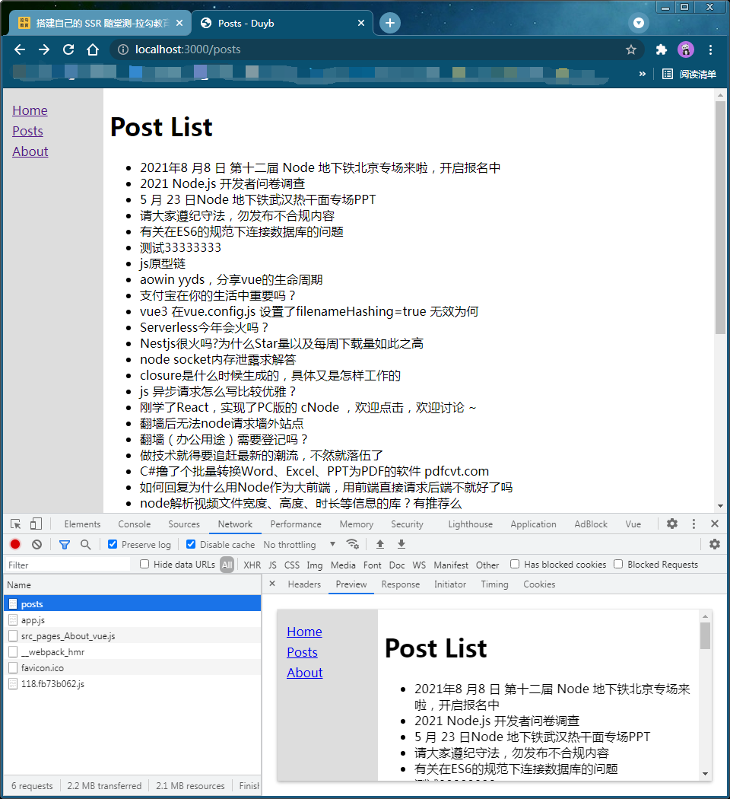
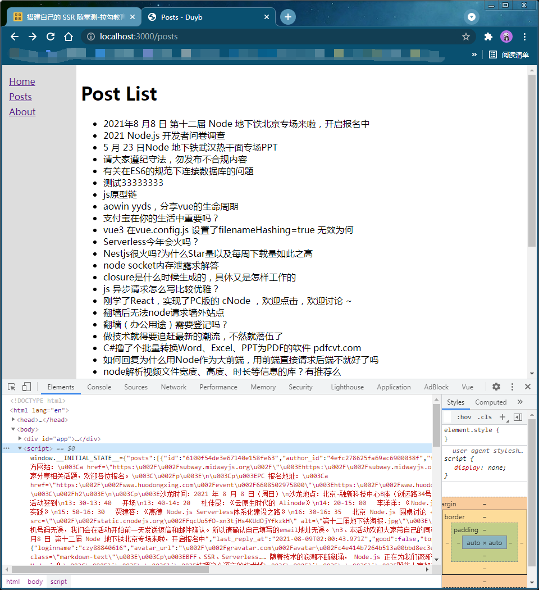

---

## [服务端渲染优化](https://ssr.vuejs.org/zh/guide/caching.html)

尽管 Vue 的 SSR 速度相当快，但由于创建组件实例和虚拟 DOM 节点的成本，它无法与纯基于字符串
的模板的性能相匹配。在 SSR 性能至关重要的情况下，明智地利用缓存策略可以极大地缩短响应时间并减少服务器负载。

缓存能够更快的将内容发送给客户端，提升 web 应用程序的性能，同时减少服务器的负载。

### [页面级别缓存 (Page-level Caching)](https://ssr.vuejs.org/guide/caching.html#page-level-caching)

对特定的页面合理的应用 [micro-caching](https://www.nginx.com/blog/benefits-of-microcaching-nginx/) 能够大大改善服务器处理并发的能力(吞吐率 RPS )。

但并非所有页面都适合应用 micro-caching 缓存策略，我们可以将资源分为三类：

- 静态资源：如 js 、 css 、 images 等。
- 用户特定的动态资源：不同的用户访问相同的资源会得到不同的内容。
- 用户无关的动态资源：任何用户访问该资源都会得到相同的内容，但该内容可能在任意时间发生变化，如博客文章。

只有“用户无关的动态资源”适合应用 [micro-caching](https://github.com/isaacs/node-lru-cache) 缓存策略。

安装依赖：`npm i lru-cache`

> [vue-ssr/server.js](../code/vue-ssr/server.js)

```js
const express = require('express');
const fs = require('fs');
const { createBundleRenderer } = require('vue-server-renderer');
const setupDevServer = require('./build/setup-dev-server');
const LRU = require('lru-cache');

const cache = new LRU({
  max: 100,
  maxAge: 10000, // Important: entries expires after 1 second.
});

const isCacheable = (req) => {
  console.log(req.url);
  if (req.url === '/posts') {
    return true;
  }
};

const app = express();

app.use('/dist', express.static('./dist'));

const isProd = process.env.NODE_ENV === 'production';
let renderer;
let onReady;
if (isProd) {
  const serverBundle = require('./dist/vue-ssr-server-bundle.json');
  const template = fs.readFileSync('./index.template.html', 'utf-8');
  const clientManifest = require('./dist/vue-ssr-client-manifest.json');
  renderer = createBundleRenderer(serverBundle, {
    template,
    clientManifest,
  });
} else {
  // 开发模式 -> 监视打包构建 -> 重新生成 Renderer 渲染器
  onReady = setupDevServer(app, (serverBundle, template, clientManifest) => {
    renderer = createBundleRenderer(serverBundle, {
      template,
      clientManifest,
    });
  });
}

const render = async (req, res) => {
  try {
    const cacheable = isCacheable(req);
    if (cacheable) {
      const html = cache.get(req.url);
      if (html) {
        return res.end(html);
      }
    }
    const html = await renderer.renderToString({
      title: 'SSR',
      meta: `<meta name="SSR of Vue" content="SSR">`,
      url: req.url,
    });
    res.setHeader('Content-Type', 'text/html; charset=utf8');
    res.end(html);
    if (cacheable) {
      cache.set(req.url, html);
    }
  } catch (err) {
    res.status(500).end('Internal Server Error.');
  }
};

// 服务端路由设置为 *，意味着所有的路由都会进入这里
app.get(
  '*',
  isProd
    ? render
    : async (req, res) => {
        // 等待有了 Renderer 渲染器以后，调用 render 进行渲染
        await onReady;
        render(req, res);
      }
);

app.listen(3000, () => {
  console.log('server running at port 3000.');
});
```

### Gzip 压缩: [compression](https://github.com/expressjs/compression)

注意事项：

- 默认的[过滤器](https://github.com/expressjs/compression#filter)功能使用 [compressible](https://github.com/jshttp/compressible) 模块来确定 res.getHeader（'Content-Type'）是否可压缩。

```js
var compression = require('compression');
var express = require('express');

var app = express();
app.use(compression({ filter: shouldCompress }));

function shouldCompress(req, res) {
  if (req.headers['x-no-compression']) {
    // don't compress responses with this request header
    return false;
  }

  // fallback to standard filter function
  return compression.filter(req, res);
}
```

### [组件级别缓存 (Component-level Caching)](https://ssr.vuejs.org/zh/guide/caching.html#%E7%BB%84%E4%BB%B6%E7%BA%A7%E5%88%AB%E7%BC%93%E5%AD%98-component-level-caching)

vue-server-renderer 内置支持组件级别缓存 (component-level caching)。
要启用组件级别缓存，你需要在创建 renderer 时提供[具体缓存实现方式(cache implementation)](https://ssr.vuejs.org/zh/api/#cache)。典型做法是传入 [lru-cache](https://github.com/isaacs/node-lru-cache)：
