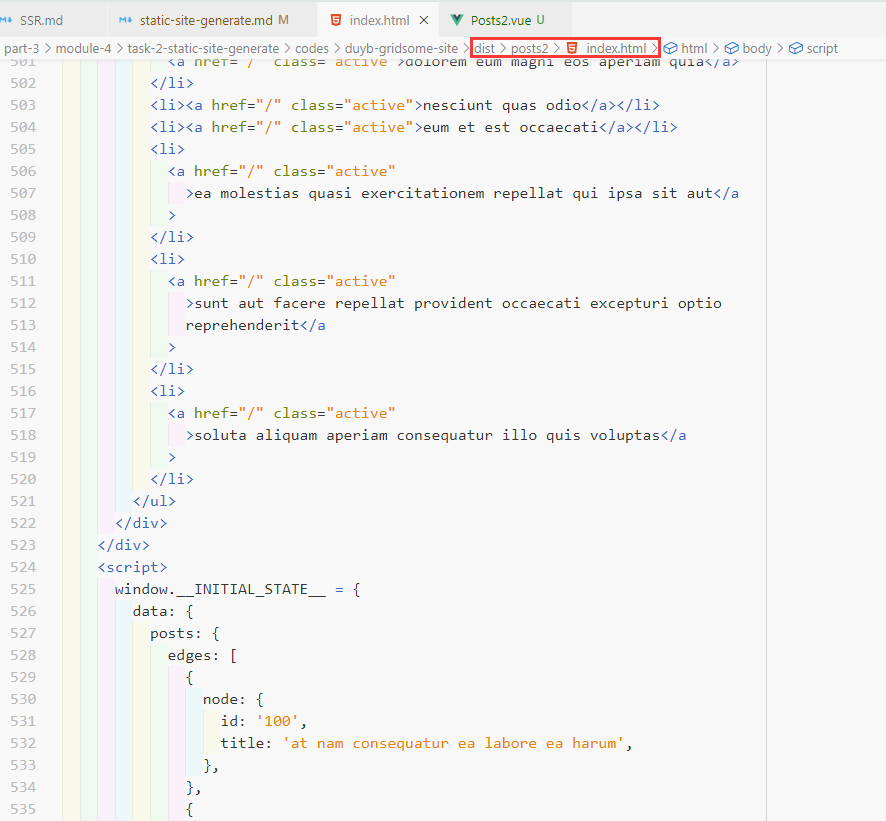
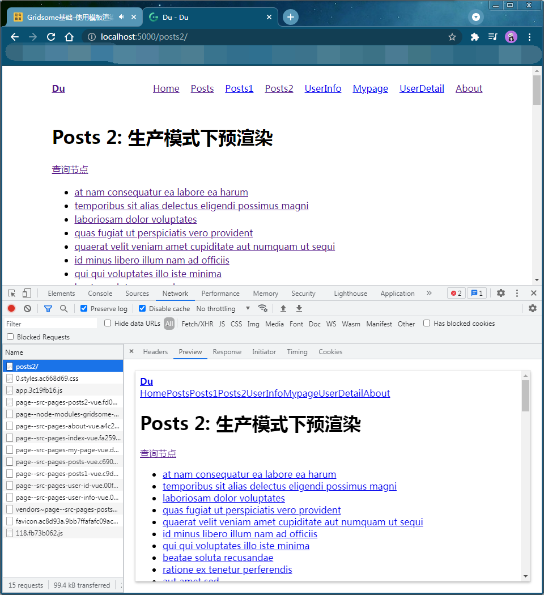
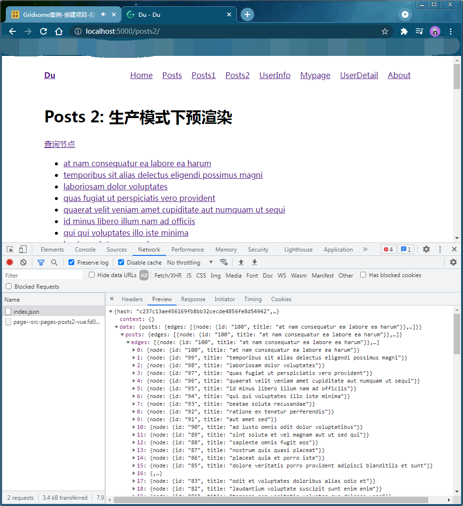
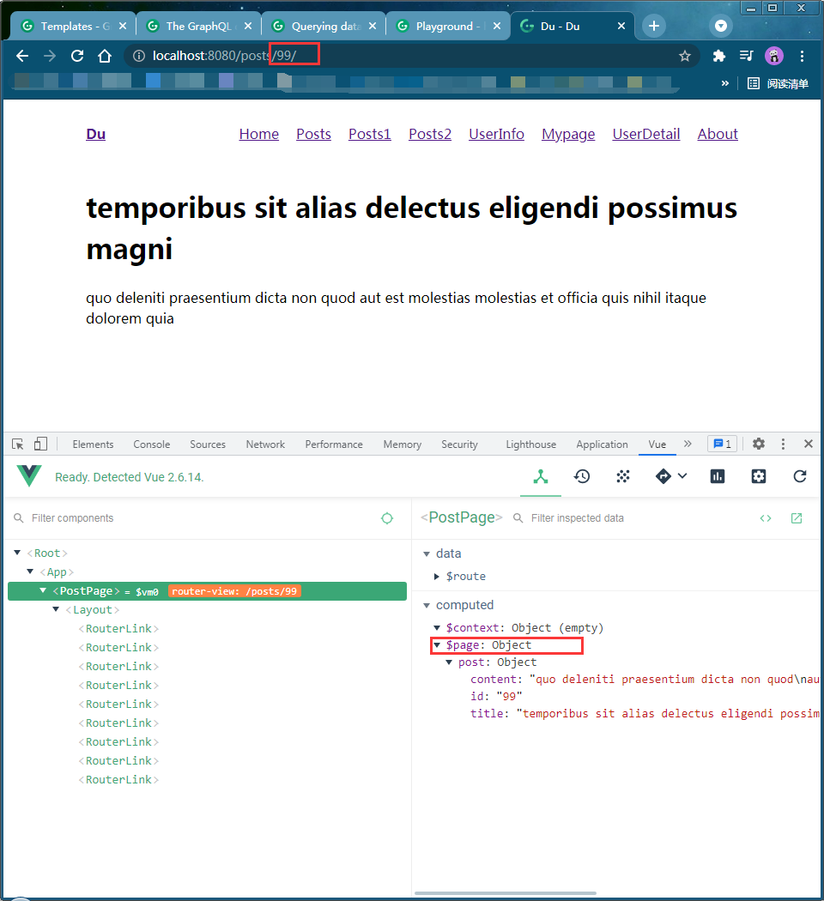
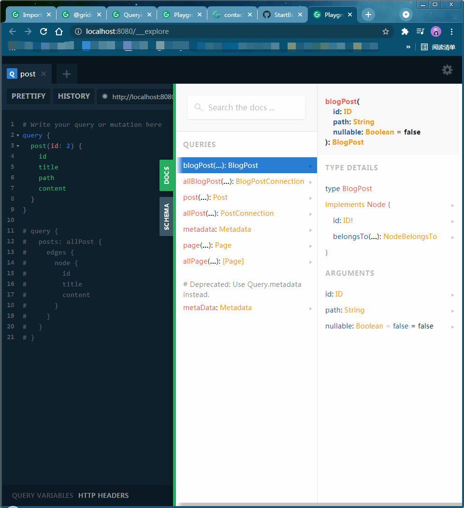

# 静态站点生成

---

- [静态站点生成](#静态站点生成)
  - [Gridsome](#gridsome)
    - [是什么](#是什么)
    - [为什么选择 Gridsome](#为什么选择-gridsome)
    - [什么是 Jamstack](#什么是-jamstack)
    - [它是如何工作的](#它是如何工作的)
    - [备选方案](#备选方案)
    - [使用场景](#使用场景)
  - [Gridsome 起步](#gridsome-起步)
    - [1、安装 Gridsome CLI](#1安装-gridsome-cli)
    - [2、创建 Gridsome 项目](#2创建-gridsome-项目)
    - [3、目录结构](#3目录结构)
    - [4、自己试一试](#4自己试一试)
  - [项目配置](#项目配置)
  - [核心概念](#核心概念)
    - [Pages](#pages)
      - [File-based pages](#file-based-pages)
      - [Programmatic pages](#programmatic-pages)
      - [动态路由](#动态路由)
        - [File-based dynamic routes](#file-based-dynamic-routes)
        - [Programmatic dynamic routes](#programmatic-dynamic-routes)
        - [生成重写规则](#生成重写规则)
      - [页面 meta 信息](#页面-meta-信息)
      - [自定义 404 页面](#自定义-404-页面)
    - [集合](#集合)
      - [添加集合](#添加集合)
      - [使用 source plugins 添加集合](#使用-source-plugins-添加集合)
      - [使用 Data Store API 添加集合](#使用-data-store-api-添加集合)
      - [GraphQL 中的集合](#graphql-中的集合)
        - [查询节点：Querying data](#查询节点querying-data)
      - [Templates: 集合模板](#templates-集合模板)
        - [设置模板](#设置模板)
  - [博客网站](#博客网站)
    - [Gridsome: Importing data](#gridsome-importing-data)

---

## [Gridsome](https://github.com/gridsome/gridsome)

### 是什么

- GitHub 仓库：https://github.com/gridsome/gridsome
- 官网：https://gridsome.org/

- Gridsome 是由 Vue.js 驱动的 [Jamstack](https://jamstack.org/) 框架，用于构建默认情况下快速生成的静态生成的网站和应用。
- Gridsome 是 Vue 提供支持的静态站点生成器，用于为任何无头 CMS，本地文件或 API 构建可用于 CDN 的网站
- 使用 Vue.js，webpack 和 Node.js 等现代工具构建网站。通过 npm 进行热重载并访问任何软件包，并使用自动前缀在您喜欢的预处理器（如 Sass 或 Less）中编写 CSS。
- 基于 Vue.js 的 Jamstack 框架
- Gridsome 使开发人员可以轻松构建默认情况下快速生成的静态生成的网站和应用程序
- Gridsome 允许在内容里面引用任何 CMS 或数据源。
  从 WordPress，Contentful 或任何其他无头 CMS 或 API 中提取数据，并在组件和页面中使用 GraphQL 访问它。

### 为什么选择 Gridsome

- **Vue.js for frontend** - The simplest & most approachable frontend framework.
- **Data sourcing** - Use any Headless CMSs, APIs or Markdown-files for data.
- **Local development with hot-reloading** - See code changes in real-time.
- **File-based page routing** - Any `Name.vue` file in `src/pages` is a static route.
- **Dynamic routing** - Any `[param].vue` file in `src/pages` is a dynamic route.
- **Static file generation** - Deploy securely to any CDN or static web host.
- **GraphQL data layer** - Simpler data management with a centralized data layer.
- **Automatic Code Splitting** - Builds ultra performance into every page.
- **Plugin ecosystem** - Find a plugin for any job.

### 什么是 [Jamstack](https://gridsome.org/docs/jamstack)

Gridsome 是一个 Jamstack 框架。 Jamstack 使您可以通过预渲染文件并直接从 CDN 直接提供文件来构建快速安全的站点和应用程序，而无需管理或运行 Web 服务器。

### 它是如何工作的

Gridsome 生成静态 HTML，一旦加载到浏览器中，该 HTML 就会渗入 Vue SPA。这意味着您可以使用 Gridsome 构建静态网站和动态应用程序。

Gridsome 为每个页面构建一个.html 文件和一个.json 文件。加载第一页后，它仅使用.json 文件来预取和加载下一页的数据。它还为需要它的每个页面构建一个.js 包（代码拆分）。

它使用 `vue-router` 进行 SPA 路由，并使用 [vue-meta](https://github.com/nuxt/vue-meta) 来管理\<head\>。

Gridsome 默认添加最小 57kB 的 gzip JS 捆绑包大小（vue.js，vue-router，vue-meta 和一些用于图像延迟加载的文件）。

> [详细了解其工作原理](https://gridsome.org/docs/how-it-works)

### 备选方案

- [VuePress](https://vuepress.vuejs.org/)
- [Nuxt](https://nuxtjs.org/)
- [Gatsby.js](https://www.gatsbyjs.org/)

### 使用场景

- 不适合管理系统
- 简单页面展示
- 想要有更好的 SEO
- 想要有更好的渲染性能

---

## [Gridsome 起步](https://gridsome.org/docs/)

### 1、安装 Gridsome CLI

```sh
# 使用 yarn
yarn global add @gridsome/cli

# 使用 npm
npm install --global @gridsome/cli


# 查看是否安装成功
gridsome --version
```

### 2、创建 Gridsome 项目

```sh
# 创建项目
gridsome create my-gridsome-site

# 进入项目中
cd my-gridsome-site

# 启动开发模式，或 npm run develop
gridsome develop
```

> gridsome 项目安装依赖注意事项：
>
> - 配置 node-gyp 编译环境
>
>   - https://github.com/nodejs/node-gyp
>
> - 配置环境变量：`npm_config_sharp_libvips_binary_host` 为 `https://npm.taobao.org/mirrors/sharp-libvips/`
>   - https://github.com/lovell/sharp-libvips
>   - https://developer.aliyun.com/mirror/NPM
>   - https://npm.taobao.org/mirrors
>   - https://sharp.pixelplumbing.com/install
>     - `npm config set sharp_binary_host "https://npm.taobao.org/mirrors/sharp"`
>     - `npm config set sharp_libvips_binary_host "https://npm.taobao.org/mirrors/sharp-libvips"`
> - 配置 hosts：`199.232.68.133 raw.githubusercontent.com`
>   - https://www.ipaddress.com/

### 3、目录结构

```bash
.
├── src
│   ├── components # 公共组件
│   ├── layouts # 布局组件
│   ├── pages # 页面路由组件
│   ├── templates # 模板文件
│   ├── favicon.png # 网站图标
│   └── main.js # 应用入口
├── static # 静态资源存储目录，该目录中的资源不做构建处理
├── README.md
├── gridsome.config.js # 应用配置文件
├── gridsome.server.js # 针对服务端的配置文件
├── package-lock.json
└── package.json
```

### 4、自己试一试

- 在 `src/pages` 目录中创建一个 `.vue` 组件

5、构建

```bash
gridsome build
```

构建结果默认输出到 `dist` 目录中。

Gridsome 会把每个路由文件构建为独立的 HTML 页面。

6、部署

可以把构建结果 `dist` 放到任何 Web 服务器中进行部署。

例如我们这里使用 Node.js 命令行工具 [serve](https://github.com/vercel/serve) 来测试构建结果。

```bash
npm install -g serve

serve dist
```

或者可以部署到其它第三方托管平台：https://gridsome.org/docs/deployment/。

或是自己的服务器，都可以！

--

## [项目配置](https://gridsome.org/docs/config/)

> [duyb-gridsome-site/gridsome.config.js](../codes/duyb-gridsome-site/gridsome.config.js)

```js
// This is where project configuration and plugin options are located.
// Learn more: https://gridsome.org/docs/config

// Changes here require a server restart.
// To restart press CTRL + C in terminal and run `gridsome develop`

module.exports = {
  siteName: 'Du',
  siteDescription: 'static site grnerated by Gridsome',
  plugins: [],
};
```

| 属性                     | 类型               | 默认值                | 说明                                                                                                                                                                                                                                                |
| ------------------------ | ------------------ | --------------------- | --------------------------------------------------------------------------------------------------------------------------------------------------------------------------------------------------------------------------------------------------- |
| siteName                 | string             | `<dirname>`           | 该名称通常在标题标签中使用。                                                                                                                                                                                                                        |
| siteDescription          | string             | `''`                  | 页面描述，`<meta name="description" content="xxx">`                                                                                                                                                                                                 |
| pathPrefix               | string             | `''`                  | Gridsome 假定您的项目是从域的根目录提供的。如果您的项目将托管在名为 my-app 的子目录中，则将此选项更改为“ / my-app”。                                                                                                                                |
| titleTemplate            | string             | `%s - <siteName>`     | 设置标题标签的模板。 ％s 占位符将替换为您在页面中设置的 metaInfo 的标题。                                                                                                                                                                           |
| plugins                  | Array              | `[]`                  | 通过将插件添加到 plugins 数组来激活插件。                                                                                                                                                                                                           |
| templates                | object             | `{}`                  | 定义 collections 的路由和模板。                                                                                                                                                                                                                     |
| metadata                 | object             | `{}`                  | 将全局元数据添加到 GraphQL 模式。                                                                                                                                                                                                                   |
| icon                     | string \| object   | `'./src/favicon.png'` | Gridsome 默认情况下会将位于 src / favicon.png 的任何图像用作 favicon 和 touchicon，但您可以定义其他路径或大小等。图标应为正方形且至少 16 个像素。网站图标将调整为 16、32、96 像素。默认情况下，触摸图标的大小将调整为 76、152、120、167、180 像素。 |
| configureWebpack         | object \| Function |                       | 如果该选项是一个对象，它将与内部配置合并。                                                                                                                                                                                                          |
| chainWebpack             | Function           |                       | 该函数将接收由 webpack-chain 驱动的 ChainableConfig 实例。                                                                                                                                                                                          |
| runtimeCompiler          | boolean            | false                 | 在运行时包括 Vue 模板编译器。                                                                                                                                                                                                                       |
| configureServer          | Function           |                       | 配置开发服务器。                                                                                                                                                                                                                                    |
| permalinks.trailingSlash | boolean            | true                  | 默认情况下，在页面和模板后添加斜杠。启用此选项后，具有动态路由的页面将不包含尾部斜杠，并且服务器上必须具有额外的重写规则才能正常工作。另外，\<g-link\>的静态路径不会自动包含尾部斜杠，而应包含在路径中：                                            |
| permalinks.slugify       |                    |                       | 使用自定义的 Slugify 方法。默认是 [@sindresorhus/slugify](https://github.com/sindresorhus/slugify)                                                                                                                                                  |
| css.split                | boolean            | false                 | 将 CSS 分成多个块。默认情况下禁用拆分。拆分 CSS 可能会导致奇怪的行为。                                                                                                                                                                              |
| css.loaderOptions        | Object             | {}                    | 将选项传递给与 CSS 相关的 loader                                                                                                                                                                                                                    |
| host                     | string             | localhost             |                                                                                                                                                                                                                                                     |
| port                     | number             | 8080                  |                                                                                                                                                                                                                                                     |
| outputDir                | string             | `'dist'`              | 运行 gridsome 构建时将在其中生成生产构建文件的目录。                                                                                                                                                                                                |

---

## [核心概念](https://gridsome.org/docs/core-concepts/)

### [Pages](https://gridsome.org/docs/core-concepts/#pages)

通过在 `src/pages` 文件夹中添加 Vue 组件来创建页面。他们使用基于文件的路由系统。例如，`src/pages/About.vue` 将是 `mywebsite.com/about/`。页面用于简单页面和列出集合的页面（例如/ blog /）。

了解有关页面的更多信息：https://gridsome.org/docs/pages/。

#### [File-based pages](https://gridsome.org/docs/pages/#file-based-pages)

- `src/pages/Index.vue` becomes `/`_(The frontpage)_
- `src/pages/AboutUs.vue` becomes `/about-us/`
- `src/pages/about/Vision.vue` becomes `/about/vision/`
- `src/pages/blog/Index.vue` becomes `/blog/`

#### [Programmatic pages](https://gridsome.org/docs/pages/#programmatic-pages)

可以使用 gridsome.server.js 中的 `createPages` 钩子以编程方式创建页面

```js
module.exports = function (api) {
  api.createPages(({ createPage }) => {
    createPage({
      path: '/my-page',
      component: './src/templates/MyPage.vue',
    });
  });
};
```

#### [动态路由](https://gridsome.org/docs/pages/#dynamic-routing)

动态路由对于仅需要客户端路由的页面很有用。例如，根据 URL 中的细分从生产环境中的外部 API 获取信息的页面。

了解有关页面的更多信息 [Dynamic Routing](https://gridsome.org/docs/dynamic-routing/)

##### [File-based dynamic routes](https://gridsome.org/docs/dynamic-routing/#file-based-dynamic-routes)

动态页面用于客户端路由。可以通过将名称包装在**方括号**中来将路由参数放置在文件和目录名称中。例如：

- `src/pages/user/[id].vue` becomes `/user/:id`.
- `src/pages/user/[id]/settings.vue` becomes `/user/:id/settings`.

**注意事项：**

- 在构建时，这将生成 `user/_id.html` 和 `user/_id/settings.html`，并且您必须具有重写规则以使其正常运行。

- 具有动态路由的页面的优先级低于固定路由。例如，如果您有一个 `/user/create` 路由和 `/user/:id` 路由，则 `/user/create` 路由将具有优先级。

> [duyb-gridsome-site/src/pages/user/[id].vue](../codes/duyb-gridsome-site/src/pages/user/[id].vue)

```html
<template>
  <Layout>
    <h1>动态路由</h1>
    <p>path : {{ $route.path }}</p>
    <p>params : {{ JSON.stringify($route.params) }}</p>
  </Layout>
</template>

<script>
  export default {
    name: 'UserDetail',
    metaInfo: {
      title: 'UserDetail',
    },
    components: {},
    props: {},
    data() {
      return {
        user: null,
      };
    },
    computed: {},
    watch: {},
    created() {},
    async mounted() {
      const { id } = this.$route.params;
      const response = await fetch(`https://api.example.com/user/${id}`);

      this.user = await response.json();
    },
    methods: {},
  };
</script>
```

始终使用 `mounted` 来获取客户端数据。由于在生成静态 HTML 时执行数据，因此在 `created` 中获取数据会引起问题。

##### [Programmatic dynamic routes](https://gridsome.org/docs/dynamic-routing/#programmatic-dynamic-routes)

```js
module.exports = function (api) {
  api.createPages(({ createPage }) => {
    createPage({
      path: '/user/:id(\\d+)',
      component: './src/templates/User.vue',
    });
  });
};
```

##### 生成重写规则

Gridsome 无法为动态路由的每种可能的变体生成 HTML 文件，这意味着直接访问 URL 时最有可能显示 404 页。而是，Gridsome 生成一个 HTML 文件，该文件可用于重写规则。例如，类似/ `user/:id` 的路由将生成位于`/user/_id.html` 的 HTML 文件。您可以具有重写规则，以将所有与 `user/:id` 匹配的路径映射到该文件。

由于每种服务器类型都有自己的语法，因此必须手动生成重写规则。 `afterBuild` 钩子中的 `redirects` 数组包含应生成的所有必要的重写规则。

```js
const fs = require('fs');

module.exports = {
  afterBuild({ redirects }) {
    for (const rule of redirects) {
      // rule.from   - The dynamic path
      // rule.to     - The HTML file path
      // rule.status - 200 if rewrite rule
    }
  },
};
```

#### [页面 meta 信息](https://gridsome.org/docs/pages/#page-meta-info)

Gridsome 使用 [vue-meta](https://vue-meta.nuxtjs.org/) 处理有关页面的元信息。

```html
<template>
  <div>
    <h1>Hello, world!</h1>
  </div>
</template>

<script>
  export default {
    metaInfo: {
      title: 'Hello, world!',
      meta: [{ name: 'author', content: 'Du' }],
    },
  };
</script>
```

#### [自定义 404 页面](https://gridsome.org/docs/pages/#custom-404-page)

创建一个 `src/pages/404.vue` 组件以具有一个自定义 404 页面。

---

### [集合](https://gridsome.org/docs/collections/)

集合是一组节点，每个节点都包含带有自定义数据的字段。如果您要在网站上放置博客文章，标签，产品等，则集合很有用。

#### 添加集合

集合可以通过 [source plugins](https://gridsome.org/plugins/) 添加，也可以使用 [Data Store API](https://gridsome.org/docs/data-store-api/) 自己添加。

在开发和构建期间，这些集合存储在本地内存数据存储中。节点可以来自本地文件（Markdown，JSON，YAML 等）或任何外部 API。


#### [使用 source plugins 添加集合](https://gridsome.org/docs/collections/#add-collections-with-source-plugins)

将集合添加到 Gridsome 的最简单方法是使用源插件。本示例从 WordPress 网站创建集合。源插件的 typeName 选项通常用于为插件添加的集合名称添加前缀。

```js
// gridsome.config.js
module.exports = {
  plugins: [
    {
      use: '@gridsome/source-wordpress',
      options: {
        baseUrl: 'YOUR_WEBSITE_URL',
        typeName: 'WordPress',
      },
    },
  ],
};
```

你可以在[这里](https://gridsome.org/plugins)浏览插件列表。

#### [使用 Data Store API 添加集合](https://gridsome.org/docs/collections/#add-collections-with-data-store-api)

您可以从任何外部 API 手动添加集合。

本示例创建一个名为 Post 的集合，该集合从 API 获取内容并将结果作为节点添加到该集合中。

```js
// gridsome.server.js
const axios = require('axios');

module.exports = function (api) {
  api.loadSource(async (actions) => {
    const collection = actions.addCollection('Post');

    const { data } = await axios.get(
      'https://jsonplaceholder.typicode.com/posts'
    );

    for (const item of data) {
      collection.addNode({
        id: item.id,
        title: item.title,
        content: item.content,
      });
    }
  });
};
```

了解有关 [Data Store API](https://gridsome.org/docs/data-store-api/) 的更多信息。

#### GraphQL 中的集合

每个集合将向 [GraphQL schema](https://gridsome.org/docs/data-layer/) 添加两个根字段，这些根字段用于检索页面中的节点。

字段名称是根据集合名称自动生成的。如果您将集合命名为 Post，那么在架构中将具有以下可用字段：

- `post` 通过 ID 获取单个节点。
- `allPost` 获取节点列表（可以排序和过滤等）。

**自动生成 schema**

**探索可用的类型和字段**

您可以通过在 [GraphQL 资源管理器](https://gridsome.org/docs/data-layer#the-graphql-explorer)中打开架构选项卡来浏览可用字段。

阅读有关如何在 GraphQL 中查询节点的更多信息：https://gridsome.org/docs/querying-data/。

##### 查询节点：[Querying data](https://gridsome.org/docs/querying-data/)

您可以从 GraphQL 数据层查询数据到任何 `Page`, `Template` or `Component`。
在 Vue Components 中使用 `<page-query>` 或 `<static-query>` 块添加查询。

- `<page-query>` in Pages & Templates.
- `<static-query>` in Components.

> [duyb-gridsome-site/src/pages/Posts2.vue](../codes/duyb-gridsome-site/src/pages/Posts2.vue)

```html
<template>
  <div>
    <div v-for="edge in $page.posts.edges" :key="edge.node.id">
      <h2>{{ edge.node.title }}</h2>
    </div>
  </div>
</template>

<page-query>
  query { posts: allPost { edges { node { id title } } } }
</page-query>
```

生产模式下静态化预渲染：`duyb-gridsome-site\dist\posts2\index.html`

- 
- 刷新页面：
  
- 单页面导航：`http://localhost:5000/assets/data/posts2/index.json`
  

#### Templates: [集合模板](https://gridsome.org/docs/templates/)

> 模板用于为集合中的节点创建单个页面。节点需要相应的页面才能显示在其自己的 URL 上。

##### [设置模板](https://gridsome.org/docs/templates/#setup-templates)

- [duyb-gridsome-site/src/templates/Post.vue](../codes/duyb-gridsome-site/src/templates/Post.vue)

  ```html
  <template>
    <Layout>
      <div class="template-post">
        <h1>{{ $page.post.title }}</h1>
        <article>{{ $page.post.content }}</article>
      </div>
    </Layout>
  </template>

  <page-query>
    query ($id: ID!) { post (id: $id) { id title content } }
  </page-query>
  ```

- [duyb-gridsome-site/gridsome.config.js](../codes/duyb-gridsome-site/gridsome.config.js)

  ```js
  module.exports = {
    templates: {
      Post: [
        {
          path: 'posts/:id',
          component: './src/template/Post.vue',
        },
      ],
    },
  };
  ```

- 

---

## 博客网站

> [startbootstrap-clean-blog](https://github.com/StartBootstrap/startbootstrap-clean-blog)

### [Gridsome: Importing data](https://gridsome.org/docs/fetching-data/)

- [Import with source plugins](https://gridsome.org/docs/fetching-data/#import-with-source-plugins)
- [Import from local files](https://gridsome.org/docs/fetching-data/#import-from-local-files)

  - [Markdown](https://gridsome.org/docs/fetching-data/#markdown)

    - plugin: [@gridsome/source-filesystem](https://gridsome.org/plugins/@gridsome/source-filesystem)
    - ```sh
      npm install @gridsome/transformer-remark
      npm install @gridsome/source-filesystem
      ```
    - ```js
      module.exports = {
        plugins: [
          {
            use: '@gridsome/source-filesystem',
            options: {
              typeName: 'BlogPost',
              path: './content/blog/**/*.md',
            },
          },
        ],
        templates: {
          BlogPost: '/blog/:year/:month/:day/:slug',
        },
      };
      ```
    - 根目录下创建 `content/blog` 目录，创建博客 `xxx.md`
    - 
